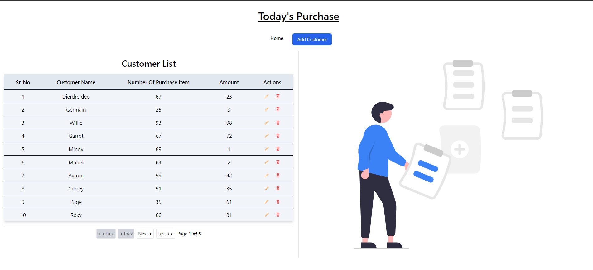

# My Shop App

## Screenshot



## Description

My Shop App is a React application built with Vite, designed to help shop owners manage their customers' purchase records. The app allows viewing, adding, editing, and deleting customer records, with details displayed in an interactive and user-friendly interface.

## Features

- **View Customers**: List all customers with their purchase count and total amount spent and Pagination.
- **Add Customer**: Add new customer records including the number of items purchased and the total amount spent.
- **Edit Customer**: Update the details of existing customer records.
- **Delete Customer**: Remove customer records with a confirmation prompt.
- **Customer Details**: Display the selected customer details in a Card.

## Technologies Used

- **Vite**: Fast and efficient build tool for modern web projects.
- **React**: Library for building user interfaces.
- **React Router DOM**: For routing and navigation.
- **TailwindCSS**: Utility-first CSS framework for styling.
- **Tanstack Table**: For displaying data in tables with sorting, pagination, and filtering capabilities.
- **Tanstack Query**: For managing server-state and fetching data from mock API.

## Project Structure

```
my-shop/
|
├── images/
|   ├── my-shop-tanstack.png
|   ├── shop.png
├── src/
|   ├── api/
│   |   ├── api.js
|   |   ├── db.json
|   ├── assets/
│   |   ├── hero.svg
│   ├── components/
|   |   │   ├── Actions.jsx
|   |   │   ├── columns.jsx
|   |   │   ├── CustomerTable.jsx
│   │   ├── AddCustomer.jsx
│   │   ├── CustomerDetails.jsx
|   |   ├── Hero.jsx
│   ├── routes/
│   │   ├── routes.jsx
│   ├── App.jsx
│   ├── index.css
│   ├── main.jsx
├── index.html
├── package.json
├── package-lock.json
├── postcss.config.js
├── README.md
├── tailwind.config.js
├── vite.config.js
```

## Installation

1. **Clone the repository**:

   ```sh
   git@github.com:amarphule/my-shop-tanstack.git
   cd my-shop-tanstack
   ```

2. **Install dependencies**:

   ```sh
   npm install
   ```

3. **Run the app**:

   ```sh
   <!-- For client -->
   npm run dev

   <!-- Run mock backend api open new terminal -->
   npx json-server .\src\api\db.json
   ```

## Usage

1. **Viewing Customers**: The main screen lists all customers with their names, number of purchases, and the total amount spent.
2. **Adding a Customer**: Click on the "Add Customer" button, fill in the details in the form, and click "Add Customer".
3. **Editing a Customer**: Click the "Edit" button next to a customer’s record, update the details in the form, and click "Update Customer".
4. **Deleting a Customer**: Click the "Delete" button next to a customer’s record, confirm the deletion in the prompt.
5. **Viewing Customer Details**: Click on a customer’s record to view their details in the Customer Details section.

## Component Overview

- **App**: The main component that contains the `CustomerTable` and `Home` and `Add Customer` button.
- **CustomerTable**: Displays the list of customers and provides options to view, edit or delete a customer.
- **CustomerDetails**: Displays the selected customer's details.
- **AddCustomer**: Form used to add and update customer.
- **Hero**: Hero svg image for empty section.

## State Management

- **Tanstack Query**: Used for managing server-state and fetching data from the mock API.

## Styling

- **TailwindCSS**: Utilized for responsive and utility-first CSS styling.

## Accessibility

- Semantic HTML and ARIA roles are used to enhance accessibility.
- Keyboard navigation and focus management are implemented to ensure the app is usable by everyone.
